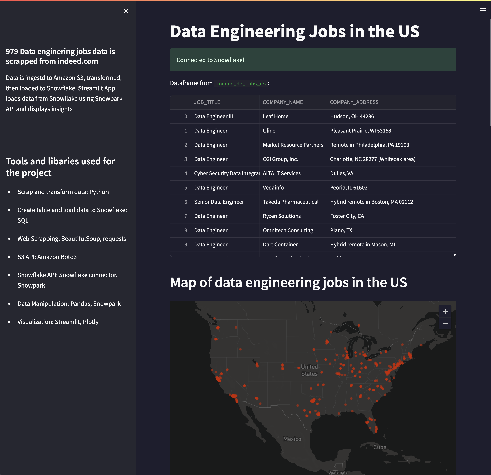
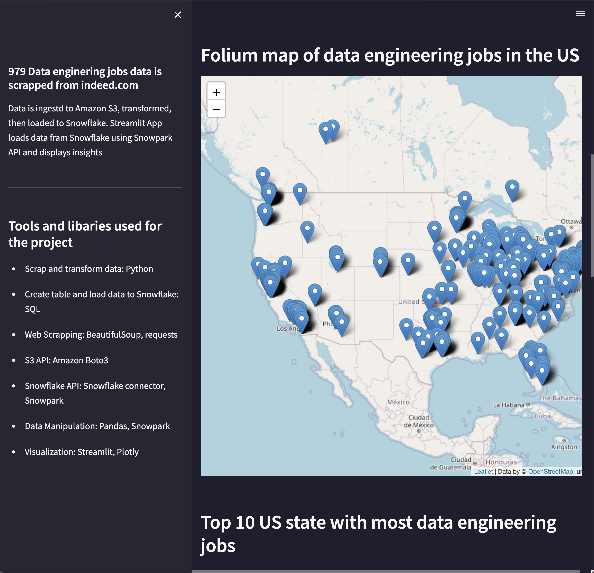
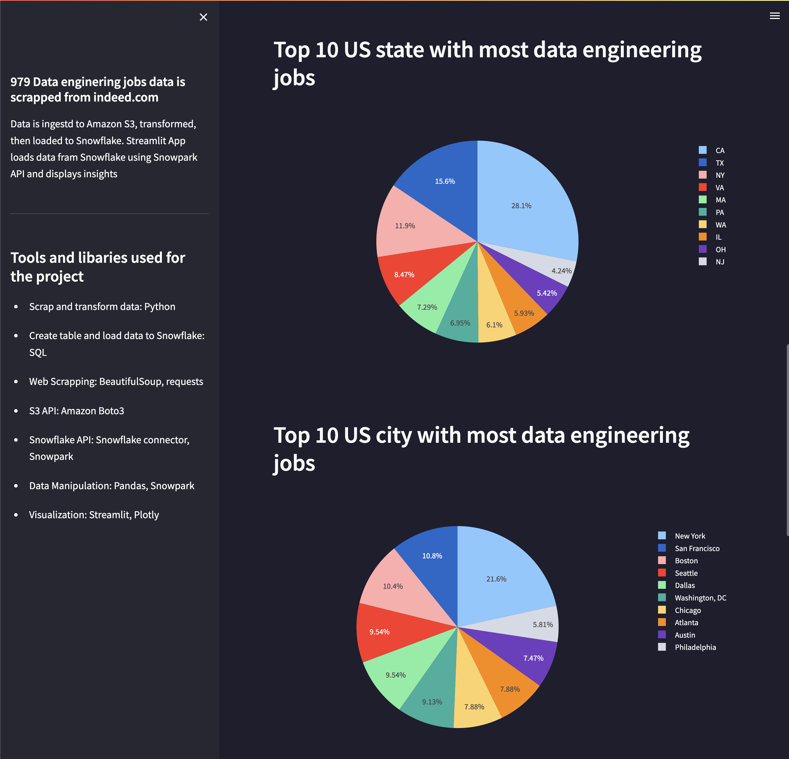
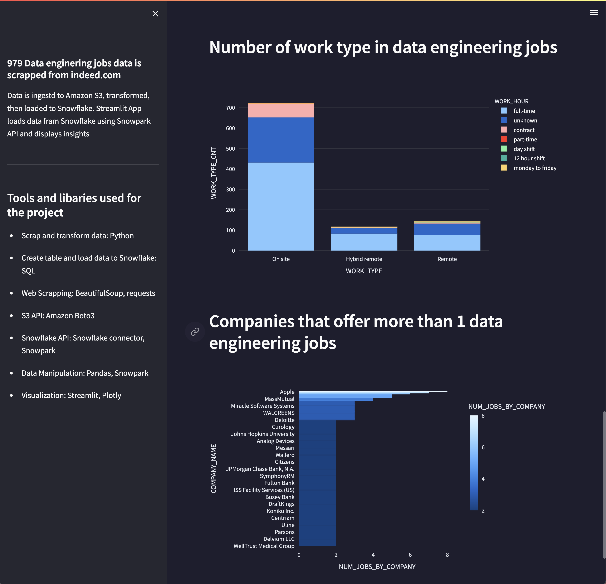

# Web srapping ETL project 
979 Data enginering jobs data is scrapped from [indeed.com](https://www.indeed.com)
Data is ingestd to Amazon S3, transformed, then loaded to Snowflake.
Streamlit App loads data from Snowflake using Snowpark API and displays insights
## Tools and libaries used for the project
- Scrap and transform data: Python
- Create table and load data to Snowflake: SQL
- Web Scrapping: BeautifulSoup, requests
- S3 API: Amazon Boto3
- Snowflake API: Snowflake connector, Snowpark
- Data Manipulation: Pandas, Snowpark
- Visualization: Streamlit, Plotly
## Streamlit App

